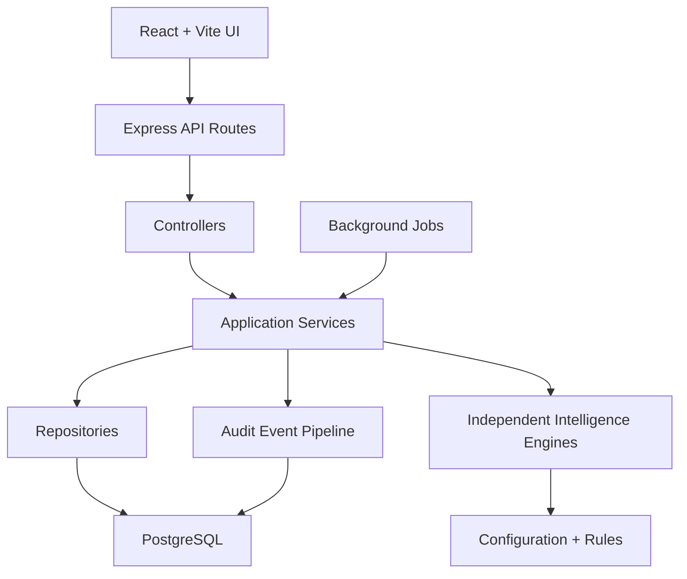

# System Architecture

TIP uses a layered architecture:

## Layers

- Frontend: presentation, navigation, forms, tables, and user interaction.
- Routes: HTTP endpoint mapping.
- Controllers: request parsing and response shaping.
- Services: business orchestration.
- Repositories: database reads and writes.
- Engines: scoring, intelligence, recommendation, and prediction logic.
- Database: durable normalized records, history, rules, audit events, and aggregate intelligence.

## Architectural Rules

- UI components never contain business logic.
- Controllers remain thin and transport-focused.
- Services coordinate use cases.
- Repositories isolate SQL.
- Engines are independent, configurable modules.
- Audit logging is a platform concern.
- Rule configuration belongs in database-backed settings or rule tables.

## Related Files

- [Architecture Diagram](architecture.md)
- [Folder Structure](folder-structure.md)
- [Module Contracts](../shared/module-contracts.md)

