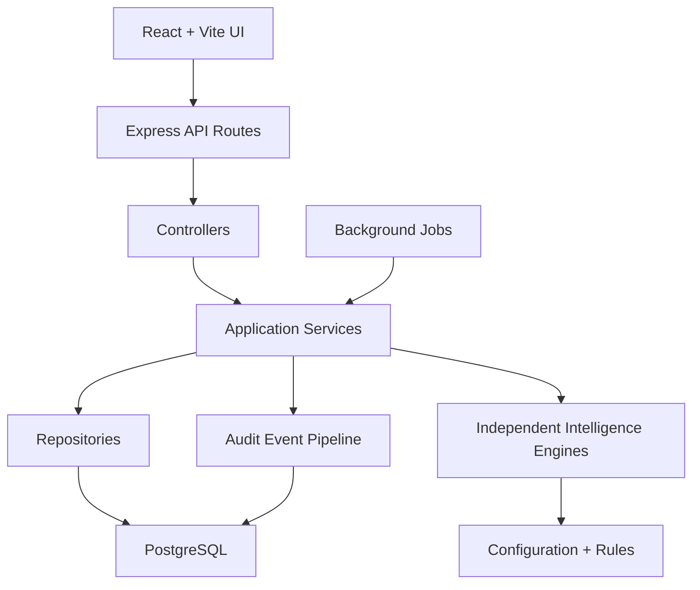

# Architecture Diagram

Architecture principles:

- UI components never contain business logic.
- Controllers remain thin and transport-focused.
- Services coordinate application behavior.
- Repositories isolate database access.
- Intelligence engines are independent and configurable.
- Audit logging is a platform concern, not a feature-specific afterthought.
- Local-first deployment is the default, with a clean path to VPS hosting later.

Future modules supported:

- Lead Intelligence
- Vendor Intelligence
- Campaign Intelligence
- Agent Intelligence
- Customer Intelligence
- Revenue Intelligence
- AI Recommendation Engine
- Compliance Center
