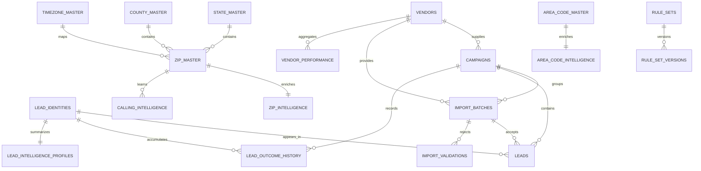

# Sprint 0.5 Database Refinement

Sprint 0.5 shifts TIP from a lead-storage database toward an intelligence database. The important change is conceptual: a phone number represents a durable identity, while a lead row represents one vendor/import/campaign occurrence of that identity.

## ER Diagram

## Relationship Explanation

`lead_identities` is the stable identity layer. It prevents the same phone number from being treated as a brand-new person every time it appears in a vendor file.

`leads` becomes an occurrence table. A single identity can have many lead occurrences across vendors, campaigns, imports, and years. This preserves source history without polluting identity-level intelligence.

`lead_outcome_history` is append-only by design. Outcomes such as No Answer, Qualified, Sale, Cancelled, Wrong Number, and DNC should become historical evidence, not overwritten status fields.

`import_validations` preserves rejected rows. Invalid data is still intelligence: bad ZIPs, malformed phones, missing state values, and duplicate patterns teach TIP which vendors and files are reliable.

`lead_intelligence_profiles` stores the current knowledge profile for an identity. It is not a calculation log. Future engines can update this table after evaluating history, geography, vendor behavior, and configurable rules.

`zip_intelligence`, `area_code_intelligence`, `vendor_performance`, and `calling_intelligence` store learned aggregate knowledge so future dashboards and recommendations do not recalculate everything from raw history every time.

`rule_sets` and `rule_set_versions` provide a general configuration architecture for future state scores, ZIP scores, vendor scores, calling windows, campaign rules, priority rules, and financial rules.

## Why Each New Table Exists

- `lead_identities`: Creates a durable, deduplicated identity keyed by normalized phone number and phone hash.
- `lead_outcome_history`: Keeps every call and business outcome as historical evidence.
- `import_validations`: Keeps rejected rows for auditability, vendor quality analysis, and future importer improvement.
- `lead_intelligence_profiles`: Stores the best current understanding of an identity across many data signals.
- `zip_intelligence`: Turns ZIP codes into knowledge assets using demographics, financial indicators, and historical performance.
- `area_code_intelligence`: Captures area-code-level performance patterns when ZIP quality is weak or missing.
- `vendor_performance`: Stores pre-aggregated vendor quality and commercial performance over time.
- `calling_intelligence`: Learns which geographic/time windows perform best.
- `rule_sets`: Provides configurable business rule containers without hardcoded business logic.
- `rule_set_versions`: Preserves rule history so future scoring and recommendation decisions remain explainable.

## Suggested Indexes

Implemented in migration `002_database_refinement.sql`:

- Phone lookup: `lead_identities(phone_normalized)`, `lead_identities(phone_hash)`.
- Lead occurrence lookup: `leads(lead_identity_id, created_at)`, `leads(import_batch_id, source_row_number)`.
- Outcome history: identity/time, campaign/time, outcome/time, and agent/time indexes.
- Import validation: batch/row, reason, severity, and JSONB GIN indexes.
- Intelligence lookup: gold score, risk level, recommended campaign, ZIP rates, area-code rates, vendor ROI, calling windows.
- Rule lookup: rule type/status, effective windows, JSONB configuration, and version history.

## Suggested Future Improvements

- Add table partitioning for `leads`, `lead_outcome_history`, `import_validations`, and `audit_log` before production-scale imports.
- Add controlled enum/reference tables for statuses, outcomes, validation severities, and risk levels once business language stabilizes.
- Add generated columns or materialized views for common reporting dimensions after real query patterns emerge.
- Add retention and archival policies for raw payloads and rejected-row JSON.
- Add privacy controls for phone hashes, PII masking, and role-based access before wider rollout.
- Add database functions or triggers for `updated_at` only after migration tooling and conventions are finalized.
